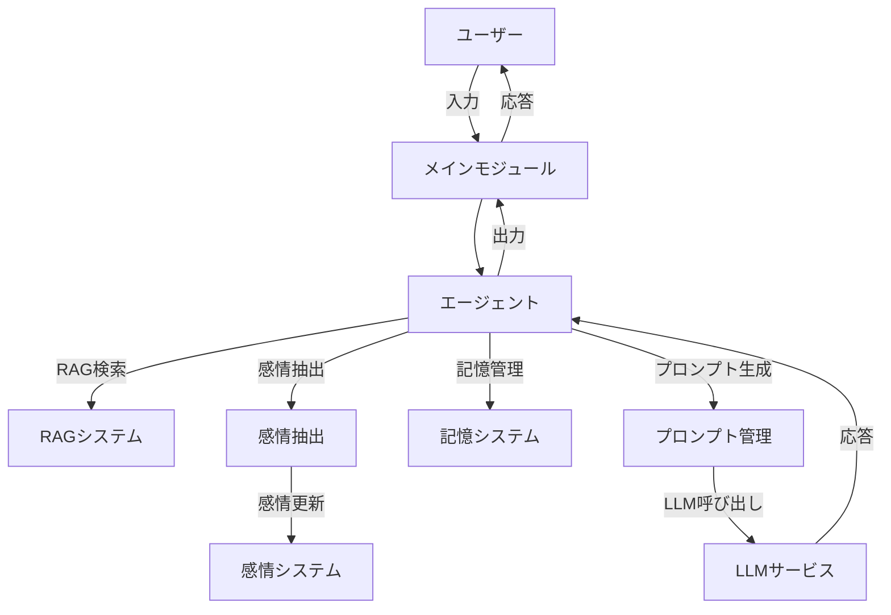

# システムパターン

## 全体アーキテクチャ



## モジュール構造

```
src/
└── human_like_ai/           # メインパッケージ
    ├── __init__.py
    ├── config/              # 設定関連
    │   ├── __init__.py
    │   ├── character.py     # キャラクター設定
    │   └── settings.py      # アプリケーション設定
    ├── core/                # コア機能
    │   ├── __init__.py
    │   ├── agent.py         # エージェント
    │   ├── conversation.py  # 会話管理
    │   ├── memory.py        # 記憶管理
    │   └── rag.py           # RAG機能
    ├── emotion/             # 感情関連
    │   ├── __init__.py
    │   ├── models.py        # 感情モデル
    │   ├── manager.py       # 感情管理
    │   └── extractor.py     # 感情抽出
    ├── utils/               # ユーティリティ
    │   ├── __init__.py
    │   ├── llm.py           # LLM関連ユーティリティ
    │   └── logging.py       # ロギング
    ├── data/                # データファイル
    │   └── character_sheet.yaml  # キャラクターシート
    └── main.py              # エントリーポイント
```

## 設計パターン

### 依存性注入パターン
コンポーネント間の結合度を下げ、テスト容易性を高めるために依存性注入パターンを採用しています。

```python
class Agent:
    def __init__(
        self,
        llm_service: LLMService,
        memory_manager: MemoryManager,
        emotion_manager: EmotionManager,
        emotion_extractor: EmotionEventExtractor,
        rag_service: CharacterRAGService,
        prompt_manager: PromptManager,
        settings: Settings | None = None,
    ) -> None:
        self.settings = settings or get_settings()
        self.llm_service = llm_service
        self.memory_manager = memory_manager
        self.emotion_manager = emotion_manager
        self.emotion_extractor = emotion_extractor
        self.rag_service = rag_service
        self.prompt_manager = prompt_manager
        self.conversation_manager = ConversationManager(
            prompt_manager=prompt_manager,
            memory_manager=memory_manager,
            emotion_manager=emotion_manager,
            emotion_extractor=emotion_extractor,
            rag_service=rag_service,
            llm_service=llm_service,
            settings=settings,
        )
```

### ファクトリーパターン
複雑なオブジェクトの生成を隠蔽するためにファクトリーパターンを採用しています。

```python
class AgentFactory:
    @staticmethod
    def create_agent(settings: Settings | None = None) -> Agent:
        """エージェントを作成します。

        Args:
            settings: アプリケーション設定。指定されない場合はデフォルト設定を使用。

        Returns:
            Agent: 作成されたエージェント
        """
        settings = settings or get_settings()
        logger = get_default_logger(settings)
        logger.info('エージェントの作成を開始します。')

        # 各コンポーネントの初期化
        llm_service = LLMService(settings)
        memory_manager = MemoryManager(settings)
        emotion_manager = EmotionManager()
        emotion_extractor = EmotionEventExtractor(settings.model_name)
        rag_service = CharacterRAGService(settings)
        prompt_manager = PromptManager(settings)

        # RAGサービスの初期化
        logger.info('キャラクターRAGサービスを初期化します。')
        rag_service.initialize_from_character_sheet()

        # エージェントの作成
        agent = Agent(
            llm_service=llm_service,
            memory_manager=memory_manager,
            emotion_manager=emotion_manager,
            emotion_extractor=emotion_extractor,
            rag_service=rag_service,
            prompt_manager=prompt_manager,
            settings=settings,
        )

        return agent
```

### インターフェースと抽象クラス
コンポーネントの交換可能性を高めるために、インターフェースと抽象クラスを活用しています。

```python
from abc import ABC, abstractmethod

class RAGService(ABC):
    """RAGサービスの抽象基底クラス。

    RAGサービスのインターフェースを定義します。
    """

    @abstractmethod
    def initialize(self, documents: list[str]) -> None:
        """RAGシステムを初期化します。

        Args:
            documents: 初期化に使用するドキュメントのリスト
        """
        pass

    @abstractmethod
    def retrieve(self, query: str, k: int = 3) -> list[dict[str, Any]]:
        """クエリに関連するドキュメントを取得します。

        Args:
            query: 検索クエリ
            k: 取得するドキュメントの数

        Returns:
            List[Dict[str, Any]]: 関連ドキュメントのリスト
        """
        pass
```

## データフロー

1. ユーザー入力の受け取り
2. 入力に基づくRAG検索
3. 感情イベントの抽出と感情状態の更新
4. 記憶の更新と関連記憶の取得
5. プロンプトの生成
6. LLMによる応答生成
7. 応答の返却とシステム状態の保存

## 主要コンポーネントの責任

### Agent
- エージェント全体の制御
- 各コンポーネントの連携
- 入出力の管理

### ConversationManager
- 会話フローの制御
- プロンプト生成と応答処理
- コンテキスト管理

### MemoryManager
- 会話履歴の管理
- 長期記憶の管理
- 関心事の管理

### EmotionManager
- 感情状態の管理
- 感情の更新と減衰
- 感情出力の生成

### EmotionEventExtractor
- ユーザー入力からの感情イベント抽出
- 感情イベントの構造化

### CharacterRAGService
- キャラクター設定の検索
- 関連情報の取得
- ベクトル検索の実行

### LLMService
- LLMとの通信
- プロンプト処理
- 応答生成
